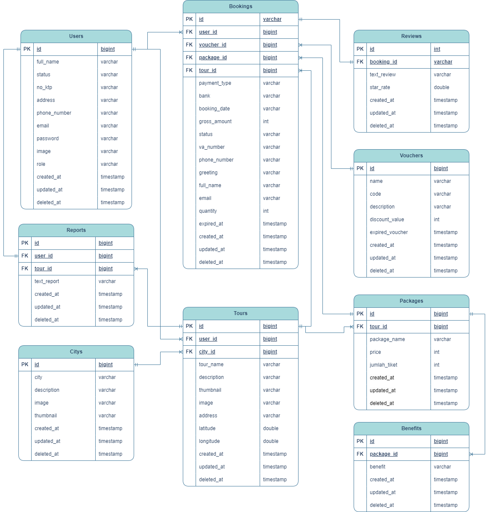
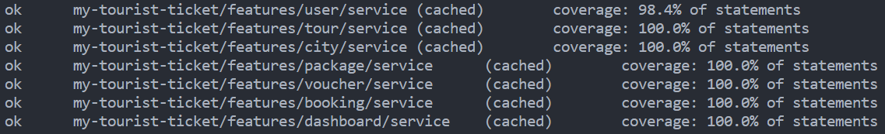

# MyTouristTicket App

<div align="center">
   <br>
   
</div>

## 💡 About the Project

MyTouristTicket is an application designed to make it easier for users who are looking for tourist destinations and user managers who want to advertise their tourist destinations. We offer easy access to purchase tourist destination tickets online and reliably.

## 🌐 Deployment

- [Vercel](https://my-tourist-tiket.vercel.app)
- [Domain Server](https://benarja.my.id)

## 🖥️ Prototype

- [FIGMA](https://www.figma.com/file/0EfonbHOCmV9YbkYLMmB0G/My-Tourist-Ticket?type=design&mode=design&t=VfaWzqfYDkLJnmwl-0)

## 🤝 Collaboration

- [Github Repository for the team](https://github.com/Capstone-Project-My-Tourist-Ticket)
- [Discord](https://discord.com/)

### ⚙️ Backend

- [Github Repository for the Backend team](https://github.com/Capstone-Project-My-Tourist-Ticket/BACK-END)
- [Swagger OpenAPI](https://app.swaggerhub.com/apis/BENTARRAHARJAX22/MyTouristTicket/1.0.0)
- [Postman Workspace](https://)

## 📱 Features

- Login
- Register
- Voucher Discount
- Payment
- Verification Pengelola
- Data Management
- Monitoring

### 🟡 As Costumer

- Register
- Login
- View profile
- Update profile
- View a list of tourist destinations and can filter them based on the city and the ones most booked
- Search for tourist destinations
- View tourist object details such as package prices, benefits, reviews and ratings
- Payment for booking tickets
- Using discount vouchers
- View booking and payment details
- Cancel bookings
- Can provide reviews and ratings after payment is verified
- Report this tour

### 🟠 As Pengelola

- View transaction history
- View a list of managed tourist destinations
- Add new tour destinations
- Update tour destinations
- Delete tour destinations
- View tour destination details
- Add packages and benefits
- Delete packages and benefits

### 🔵 As Admin

- View the monitoring dashboard
- View all list transactions that occur
- View all cities
- City updates
- Delete city
- View the list of manager accounts that request verification
- Verify the manager account (approved/rejected)
- View all existing tour destination lists
- View tour details such as packages, benefits, list reviews, list reports
- Delete tour destination
- Add discount vouchers

## 📔 Entity Relationship Diagram



## 📋 List Endpoint

| Tag     | Endpoint                            |
| ------- | ----------------------------------- |
| User    | `POST /login`                       |
| User    | `POST /users`                       |
| User    | `GET /users`                        |
| User    | `PUT /users`                        |
| User    | `DELETE /users`                     |
| User    | `GET /users/admin`                  |
| User    | `PUT /users/admin:id`               |
| City    | `POST /citys`                       |
| City    | `GET /citys`                        |
| City    | `GET /citys/:id`                    |
| City    | `PUT /citys/:id`                    |
| City    | `DELETE /citys/:id`                 |
| Tour    | `POST /tours`                       |
| Tour    | `GET /tours`                        |
| Tour    | `GET /tours/:id`                    |
| Tour    | `PUT /tours/:id`                    |
| Tour    | `DELETE /tours/:id`                 |
| Tour    | `GET /tours/pengelola`              |
| Tour    | `GET /tours/bycity/:city_id`        |
| Tour    | `POST /tours/:tour_id/report`       |
| Tour    | `GET /tours/:tour_id/report`        |
| Tour    | `GET /tours/search`                 |
| Tour    | `GET /tours/:tour_id/reviews`       |
| Package | `POST /packages/:tour_id`           |
| Package | `GET /packages/:tour_id`            |
| Package | `DELETE /packages/:id`              |
| Voucher | `POST /vouchers`                    |
| Voucher | `GET /vouchers`                     |
| Voucher | `PUT /vouchers/:id`                 |
| Voucher | `DELETE /vouchers/:id`              |
| Booking | `POST /bookings`                    |
| Booking | `PUT /bookings/:id`                 |
| Booking | `POST /bookings/:booking_id/review` |
| Booking | `GET /bookings/users`               |
| Booking | `GET /bookings/users/:booking_id`   |
| Booking | `GET /bookings/admin`               |
| Booking | `GET /bookings/pengelola`           |
| Admin   | `GET /admin/dashboard`              |

## 🛡️ Testing Coverage



## ⚛️ Tech Stack

- **Development**
  - Google Cloud Platform
  - Docker
  - Cloud Flare
  - Niaga Hoster
- **CI/CD**
  - Github Actions
- **Third Party API**
  - Midtrans
  - Cloudinary
- **Tools and Environment**
  - Golang
  - Gorm
  - Echo
  - MySQL
  - JWT
  - VSCode
  - Postman
  - Swagger
  - Draw.io

## ✅ Requirement

Things you need to run the MyTouristTicket API

1. **Cloudinary Account**
2. **Midtrans Account**

## ☸️ Installation

Follow these steps to install and set up the MyTouristTicket API:

1. **Clone the repository:**

   ```bash
   git clone https://github.com/Capstone-Project-My-Tourist-Ticket/BACK-END.git

   ```

2. **Move to Cloned Repository Folder**

   ```bash
   cd BACK-END

   ```

3. **Update dependecies**

   ```bash
   go mod tidy

   ```

4. **Create a database**

5. **Copy `.env.example` to `.env`**

   ```bash
   cp .env.example .env

   ```

6. **Configure your `.env` to configure JWT token, connect to your database, cloudinary, and Midtrans**
7. **Run MyTouristTicket API**
8. ```bash
   go run main.go
   ```

## 🦸🦸‍♀️ Author

- **Muhammad Mahiva Bentar Raharja**

  - [](https://github.com/bentarraharja)

- **Anggel Dwi Miranda**
  - [](https://github.com/anggeldwi)
